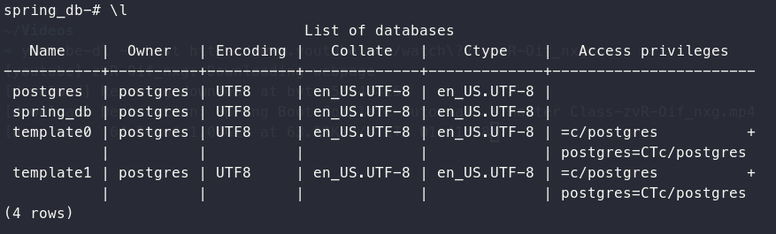
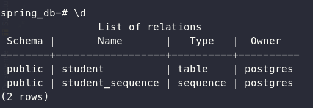
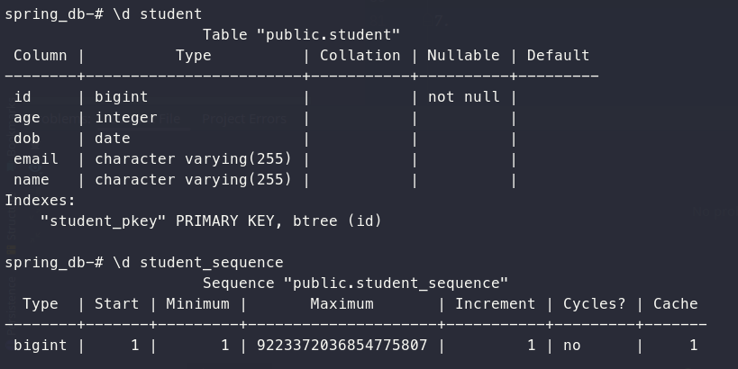

# PostgreSQL Install And Use In Archlinux

## Install PostgreSQL

1. Install PostgreSQL, example for archlinux:

    ```shell
    sudo pacman -S postgresql
    ```

2. View PostgreSQL status

    ```shell
    sudo systemctl status postgresql
    ```

3. Switch user `postgres`

   ```shell
   sudo su - postgres
   ```

4. Initialize DB

   ```shell
   initdb --locale en_US.UTF-8 /var/lib/postgres/data
   ```

5. Exit user `postgres`

   ```shell
   exit
   ```

6. Start `postgresql` service

   ```shell
   sudo systemctl start postgresql
   ```
   Then you can check `postgresql` service status use command `sudo systemctl status postgresql`.

7. Add `postgresql` to system startup

   ```shell
   sudo sudo systemctl enable postgresql
   ```
   PostgreSQL should be added to the system startup as you can see from below message:

   ```
   Created symlink /etc/systemd/system/multi-user.target.wants/postgresql.service →
   /usr/lib/systemd/system/postgresql.service.
   ```

8. Create database, for example: spring_db

   ```shell
   sudo su - postgres
   createdb spring_db
   ```

## Use PostgreSQL

Some useful command:

1. Switch DB user
   ```shell
   sudo su - postgres
   ```
2. Enter PostgreSQL shell environment
   ```shell
   psql spring_db
   ```
3. List all databases: `\l`
   
4. Connect the specification database: `\c {database_name}`
   
5. List tables, views, and sequences: `\d`
   
6. Describe table, view, sequence, or index: `\d {NAME}`
   
